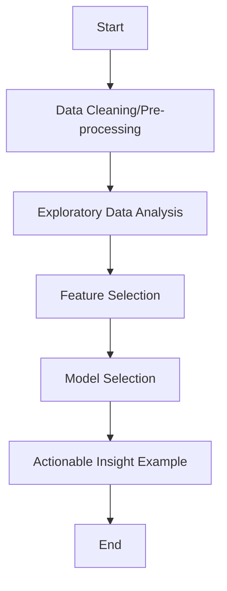

# Remedial Final Project
Armand Marcell JCDSOL-21
## Skenario dan Permasalahan Utama
Mobil99 adalah startup dealer mobil bekas yang beroperasi di Arab Saudi. Permasalahan utama yang ingin diselesaikan adalah bagaimana menentukan listing mobil yang profitable untuk diakuisisi, rekondisi, lalu dijual.

Proses Bisnis Mobil99 
- Pembelian: Mobil99 mengakuisisi mobil bekas dari masyarakat.
- Rekondisi: Setiap mobil yang dibeli melalui proses pengecekan menyeluruh, perbaikan, servis, dan pemeliharaan untuk memastikan kualitasnya.
- Penjualan: Mobil yang telah direkondisi dijual kepada konsumen.

Permasalahan utama yang ingin diselesaikan ada di tahap akusisi mobil bekas. Dikarenakan keterbatasan SDM, melihat cukup banyak variabel yang menentukan harga mobil bekas, diperlukan sebuah algoritma yang dapat merekomendasikan listing mobil secara instan dengan mempertimbangkan harga pasar mobil tersebut dan juga biaya rekondisi mobil tersebut. 

Dengan dataset yang berisi mobil - mobil bekas di Arab Saudi (diambil dari Syarah.com), diharapkan dapat membuat algoritma machine learning yang dapat langsung memberi rekomendasi dari listing mobil (dalam Syarah.com) yang "worth-it" untuk diakuisisi sehingga Mobil99 menjadi profitable.

## Flowchart
Berikut adalah flowchart dari final project ini:

## Data Source
Data source projek ini diambil dari Kaggle; https://www.kaggle.com/datasets/turkibintalib/saudi-arabia-used-cars-dataset
## Assumptions
Dalam melakukan permasalahan utama di projek ini, digunakan 3 asumsi:
- Tidak ada pajak platform (Ketika membeli atau menjual listing, tidak ada biaya tambahan)
- Biaya rekondisi/restorasi mengikuti formula: [restoration_cost = 2500 + 400 * age + 150 * (Mileage / 10000)]
- Setelah akuisisi dan rekondisi, mobil dijual tepat pada predicted price.
## Model Limitation
- Dataset yang digunakan dalam pengembangan model adalah dataset dengan kriteria "Negotiable = False", jadi data yang termasuk bisa di-negosiasi (Negotiable = True) tidak masuk dalam dataset yang dikembangkan di model ini
- Dataset juga tidak ada informasi mengenai sejarah mobil dalam listing nya (tidak ada informasi mengenai sejarah kecelakaan, sejarah kepunyaan, sejarah servis, dll.) sehingga informasi untuk membuat estimasi harga restorasi terbatas.
- Model hanya fokus terhadap harga jual pasar, tidak dipengaruhi oleh hal seperti:
  - Seberapa cepat listing akan laku/terjual
  - Demand market mobil bekas
  - Trend market mobil bekas
- Model dapat memprediksi harga berdasarkan korelasi dari fitur - fitur, bukan kausalitas.

## Tableau
https://public.tableau.com/views/FinalProject-Remedial-ArmandMarcell/Dashboard1?:language=en-US&:sid=&:redirect=auth&:display_count=n&:origin=viz_share_link

